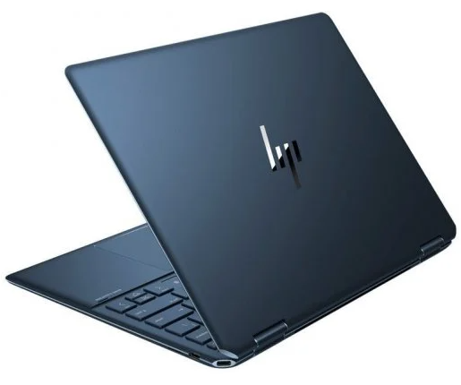

# Proposition de Modèles d'Ordinateurs

Choisir le bon ordinateur peut dépendre de vos besoins en termes de performance, de mobilité, et de budget. Voici une comparaison de plusieurs modèles pour vous aider à prendre la meilleure décision.

| **Modèle**              | **Processeur**        | **RAM**   | **Stockage**           | **Taille de l'écran** | **Autonomie** | **Prix**     | **Idéal pour**                |
|-------------------------|-----------------------|-----------|------------------------|-----------------------|---------------|--------------|-------------------------------|
| **HP Spectre x360**      | Intel Core i7         | 16 Go     | 512 Go SSD             | 13,3 pouces           | 12 heures     | 1 499 €      |     |
| **Dell XPS 13**          | Intel Core i5         | 8 Go      | 256 Go SSD             | 13,4 pouces           | 11 heures     | 1 199 €      | Portabilité et performance     |
| **Apple MacBook Air M2** | Apple M2              | 8 Go      | 256 Go SSD             | 13,6 pouces           | 18 heures     | 1 299 €      | Création multimédia, nomades   |
| **Lenovo ThinkPad X1**   | Intel Core i7         | 16 Go     | 1 To SSD               | 14 pouces             | 15 heures     | 1 699 €      | Entreprise, sécurité renforcée |
| **Acer Aspire 5**        | AMD Ryzen 5           | 8 Go      | 512 Go SSD             | 15,6 pouces           | 8 heures      | 799 €        | Bureautique, budget limité     |
| **Asus ROG Strix G15**   | AMD Ryzen 9           | 32 Go     | 1 To SSD               | 15,6 pouces           | 6 heures      | 1 999 €      | Gaming, performance extrême    |

## Détails des modèles

### 1. **HP Spectre x360**
Un excellent modèle pour les professionnels en déplacement, avec une grande autonomie et un écran tactile réversible. Parfait pour les présentations et le travail multitâche.

### 2. **Dell XPS 13**
Idéal pour ceux qui recherchent un ordinateur léger et puissant. Son design élégant et sa longue autonomie le rendent parfait pour les voyages d'affaires.

### 3. **Apple MacBook Air M2**
Connu pour son efficacité énergétique et ses performances puissantes grâce à la puce M2 d'Apple, ce modèle est parfait pour les créateurs de contenu et les étudiants.

### 4. **Lenovo ThinkPad X1**
L’ordinateur de choix pour les entreprises. Il offre une sécurité de haut niveau avec un cryptage des données et un écran légèrement plus grand pour plus de confort visuel.

### 5. **Acer Aspire 5**
Un ordinateur au bon rapport qualité/prix, idéal pour la bureautique et une utilisation quotidienne sans compromis sur la performance. 

### 6. **Asus ROG Strix G15**
Une machine de jeu puissante, avec un processeur AMD Ryzen 9 et une grande capacité de RAM, parfaite pour les gamers ou ceux qui ont besoin de beaucoup de puissance de calcul.

## Choisir le bon modèle

### Pour les utilisateurs professionnels
Si vous avez besoin d’un ordinateur pour le travail, des modèles comme le **HP Spectre x360** ou le **Lenovo ThinkPad X1** offrent des performances solides avec une longue autonomie et des options de sécurité avancées.

### Pour les créatifs et nomades
Le **MacBook Air M2** est une excellente option pour les créateurs de contenu ou les utilisateurs qui travaillent en déplacement, grâce à sa légèreté et à sa puissance.

### Pour les gamers
L'**Asus ROG Strix G15** est conçu pour des performances extrêmes avec ses 32 Go de RAM et son processeur Ryzen 9, parfait pour les jeux vidéo et les tâches gourmandes en ressources.

---

Avec cette comparaison, vous pouvez choisir le modèle qui correspond le mieux à vos besoins, qu'il s'agisse de performance, de mobilité, ou de budget.

:::tip[Information]

Pour toute demande de devis merci d'envoyer un mail à xxxx@test.Fr

:::